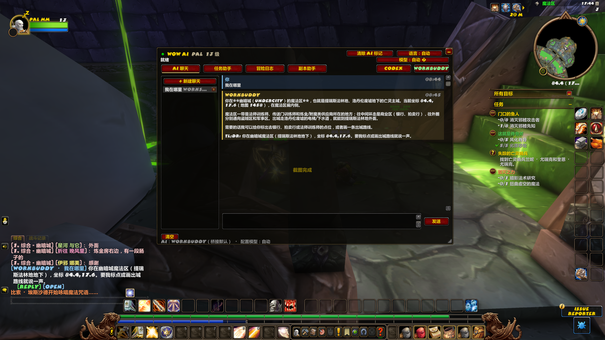
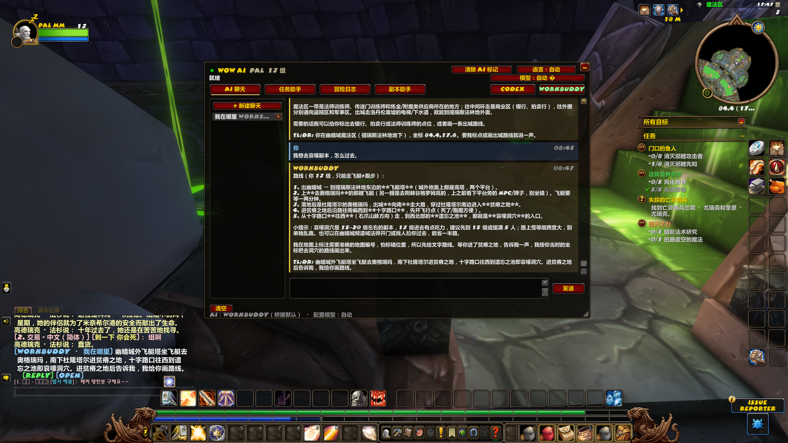
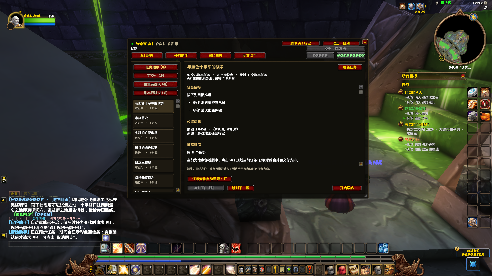
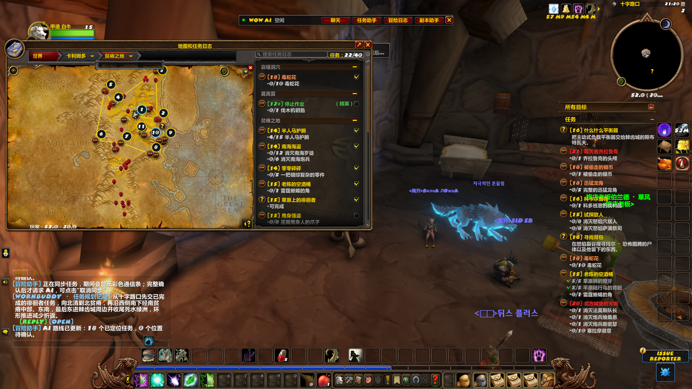
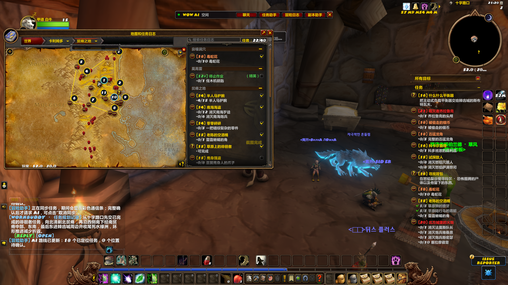
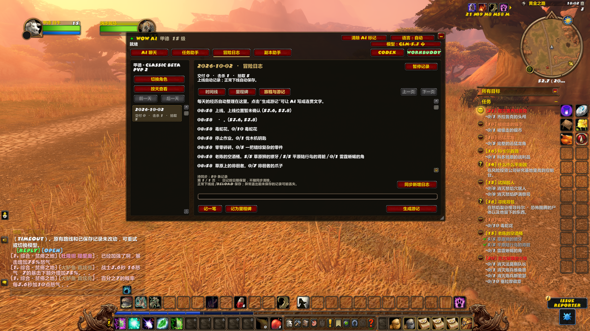
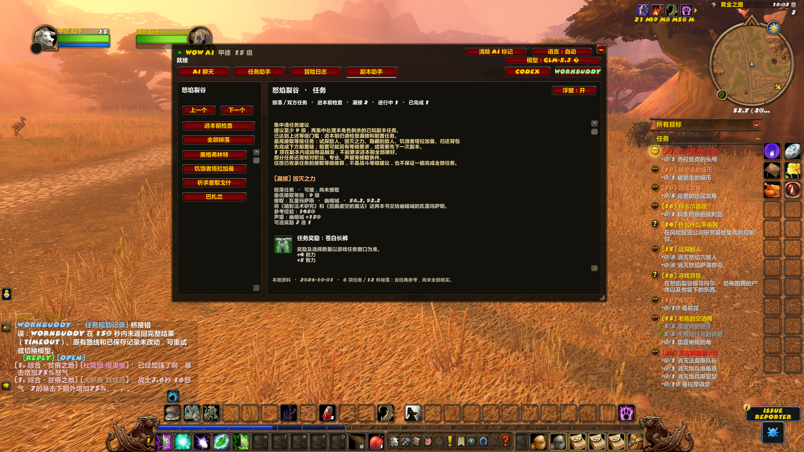
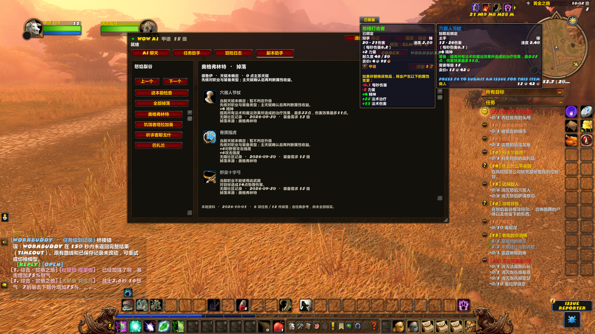

# 艾泽拉斯冒险伙伴（Azeroth Adventure Companion）

[简体中文](README.md) · [繁體中文](README.zh-TW.md) · [English](README.en.md) · [NGA 发布帖](https://bbs.nga.cn/read.php?tid=47658306)

在游戏里问 AI、安排任务路线、记录冒险、检查副本任务。

玩无限时，经常碰到几件事：身上任务一大堆，不知道怎么顺路做；跑副本前怕漏接任务；出了装备，还得查属性；一天玩下来，又想留个冒险记录。

所以在开源 WoW AI 的基础上做了这个社区增强版——**艾泽拉斯冒险伙伴(Azeroth Adventure Companion)**。游戏里的面板、插件名和命令仍保留 WoW AI / WoWAI，方便兼容已有存档。

**当前版本：0.6.0-beta.9，Windows x64 内测版，面向《魔兽世界：无限》1.60 客户端。**

## 2026-10-04 更新：0.6.0-beta.9

这次主要补上“还没接任务时怎么开始”和“这一站到底该做什么”：
1. **建议接取**：按当前地图、等级、阵营、职业和已知前置条件筛选未接任务，显示 NPC、接取坐标和条件；可单独导航接取、完成、交付及已知后续。
2. **本地图任务攻略 / 区域任务流程**：可先预览地图或等级章节，再点“使用此攻略”。有流程的地图按“集中接取 → 区域做任务 → 回程交付”组织；其余地图显示任务资料。
3. **分站行动说明**：任务详情和导航箭头悬停提示这一站去哪里、做什么、顺路兼做哪些任务、下一站去哪；任务实际完成后隐藏已完成地图标记并连接剩余区域。
4. **目标地点核对**：拆分任务目标与位置对应检查，已完成目标不再混入候选；修正部分邻图投影误认本图的情况，未知位置继续待确认。
5. **副本参考地图与资料扩充**：新增地图分页和首领位置参考，补充湿地挖掘场、达拉然等任务资料。参考地图不等于无限客户端实测坐标。

本次功能已通过自动回归与安装检查；新增流程和地图仍需游戏内实跑核对。下方截图保留 beta.8 的功能示例，新入口以 beta.9 实际界面为准。

## 下载与安装

**国内下载：夸克网盘（最新 beta.9）**
[点击获取完整 Windows x64 安装包（0.6.0-beta.9）](https://pan.quark.cn/s/a611b721e586)
文件名：WoWAI-Forever-0.6.0-beta.9-win-x64.zip，约 70.2 MB。
下载后**完整解压，再运行文件夹里的 Install.cmd**；中文安装说明也在包内。AI 登录和使用仍需自己的账号、网络与可用额度。

**GitHub 发布页与备用下载**

[版本发布页：安装包、三种语言说明及校验文件](https://github.com/hukekele-dotcom/azeroth-adventure-companion/releases/tag/v0.6.0-beta.9)
[Windows 安装包直链：WoWAI-Forever-0.6.0-beta.9-win-x64.zip](https://github.com/hukekele-dotcom/azeroth-adventure-companion/releases/download/v0.6.0-beta.9/WoWAI-Forever-0.6.0-beta.9-win-x64.zip)
[完整中文安装与使用说明](https://github.com/hukekele-dotcom/azeroth-adventure-companion/releases/download/v0.6.0-beta.9/Install-Guide-zhCN.txt)

请下载上面具名的 Windows 安装包，**完整解压后运行 Install.cmd**。发布页里的 Source code 是开发源码，玩家安装请选 Windows 包。

首次使用按这个顺序：
1. 完全退出游戏，停止旧版桥接。
2. 运行 Install.cmd，选择直接包含 WowB.exe 和 Interface 的目录，通常是 _classic_beta_。
3. 选择 Codex 或 WorkBuddy，依次点击“安装 / 升级 → 登录所选 AI → 启动桥接”。
4. 完全重启游戏，在插件列表启用 WoWAI 和 WoWAI_S 开头的通信插件；首次安装只 /reload 不够。
5. 进入角色，输入 /wow-ai 打开面板。先发“我在哪里”，再发一条后续消息，确认能连续收到回复。

安装包自带 Node.js，无需预装 Codex / WorkBuddy 桌面客户端；首次登录会联网下载所选 AI 的运行组件。以后从桌面“WoW AI 无限”启动桥接，再进入游戏即可。

**AI 功能需要你自己的账号、网络和可用额度。**Codex 使用官方 Codex CLI；WorkBuddy 入口使用官方 CodeBuddy Code 执行组件，需要单独完成中国站登录。桌面端登录状态和额度不保证互通。两种都想用，就分别完成两边登录；后台桥接要运行，桌面聊天窗口不必一直打开。

## 一、AI 聊天：带着角色信息直接问

可以直接问“我在哪里”“从这里怎么去哀嚎”“这个任务下一步做什么”。插件提供当前角色、等级、所在区域、坐标和任务等上下文，不用每次重新描述自己的位置。

支持多个聊天，游戏内可选择 Codex 或 WorkBuddy，并提供模型选择及简体、繁体、英文界面。回复在面板中保留，游戏聊天栏也会显示摘要。

图：询问当前位置，回复结合幽暗城魔法区和当前坐标。

图：接着问怎么去哀嚎，AI 给出飞船、跑图及入口的文字路线。AI 回答仍需结合游戏实际核对，尤其是无限新增或改动内容。

## 二、任务助手：把当前地图任务排成数字路线

读取身上的任务和实时目标，区分进行中、可交付、位置待确认及已跳过的副本任务。点击 AI 规划后，当前版本先用已知坐标给出本地图备用路线，再由 AI 结合完整任务目标和候选位置优化顺序。

世界地图显示 1、2、3……的区域编号及连线，导航箭头指向当前区域。相近且可以一起推进的任务合并显示；完成目标后，按实际任务进度推进到下一步，并安排已知位置的交付。

“刷新任务”更新本地信息；“任务变化自动重算”是独立开关。关闭自动重算后，进度仍会更新，需要新方案时再手动规划。“跳到下一区”只切换导航，不会把任务伪造成已完成。

图：任务列表、目标、位置来源和导航入口。

图：贫瘠之地的数字区域路线，可以按编号查看和推进。

同一路线的另一张地图截图

**新增：建议接取**
任务助手里的“建议接取”会列出当前地图上、当前角色满足已知条件的未接任务，显示任务名、NPC、坐标、最低等级和前置。相同 NPC 附近的任务可集中查看。点击“前往接取”开启独立导航；接取后按真实目标进度提示完成与交付，已知且条件满足的后续也可继续提示。右键箭头或停止导航可取消。

默认过滤副本、重复/节日、过低等级和高于角色 3 级以上的任务；物品触发任务不会当作 NPC 接取。职业、种族、专业、声望或完成记录无法确认时，不把条件猜成已满足。这个入口使用本地资料，不调用 AI，也不会替你点击 NPC 对话。

**新增：本地图任务攻略与区域任务流程**
先选择地图、预览章节，再点“使用此攻略”。有已导入章节的地图显示“区域任务流程”，可以切换上一阶段/下一阶段；其余地图提供“任务资料”。预览其他章节不会悄悄替换正在使用的流程。

流程按集中接任务、同一区域完成目标、回程交付组织，显示对话 NPC、击杀对象和所需物品，并按角色条件、前置与真实任务进度筛选。只有目标实际推进才算完成，走到坐标不算完成。可以跳过步骤，但跳过不会解锁前置，也不会把任务记成已做完。

当前本地任务索引涉及 48 张地图；其中从 RestedXP 公开 Forever 指南整理了 27 个等级章节、2,958 个接取/目标/交付动作，涉及 21 张地图（含城市和过路地图）。这些数量不是 48 篇完整实测攻略，也不是 21 张地图全部任务覆盖。没有可靠坐标的步骤仍标为待确认。

本地攻略不使用模型额度。使用攻略期间不会因任务变化自动发起 AI 重排；手动选择 AI 规划会退出本地攻略导航。离开所选地图会暂停箭头。尚未导入炉石、飞行、死亡跳跃、购物、训练等操作策略。

**分站说明与地图清理**
当前任务详情顶部和箭头悬停提示目的地、主要行动、同区兼做、剩余目标与下一站；手动切换导航后说明跟随当前站。完成区域的标记和引线会隐藏，剩余区域重新连线，未完成的兼做目标仍保留。地点与拆分目标对应关系会在桥接和插件两侧检查，旧存档中的邻图投影也会重新核对。

坐标资料库当前有 4,231 条带目标或交付坐标的任务、4,103 条接取条目，但这不代表无限全部任务已覆盖。已知在其他地图的任务、副本任务不混入本地图野外路线；未知位置会标成待确认。箭头是直线方向提示，要自己绕山、找路，**不会自动移动、打怪、接交任务，也不保证真实道路最短**。

## 三、冒险日志：按天回看，也能生成游记

上线自动开始记录，在“时间线 / 里程碑 / 旅程与游记”中查看。同一天多次上线合并为当天旅程，也能切换角色、日期或按次查看。

可记录任务接取、进度、交付、区域变化、拾取、升级、死亡复活等可观察经历；击杀参与等信息受客户端接口限制，不是完整战斗统计。可以“记一笔”补上自己的经历和感受，也能“记为里程碑”。

点击“生成游记”，所选 AI 根据已有记录整理文字，长记录会分段处理。原始素材保留，生成稿仍需要自己核对和加工。平时查看、翻页和本地记录不调用 AI；生成游记才使用模型，长日志可能产生多次调用。

图：按角色和日期查看当天记录，手记、里程碑和生成游记入口在下方。

正常退出或 /reload 保存游戏记录；“同步新增日志”将记录归档到电脑，桌面管理窗口可打开冒险档案。崩溃、断电前尚未保存或同步的内容可能丢失。

## 四、副本助手：进本前检查任务，查看掉落与装备比较

副本外就能选择准备去的副本，检查当前角色有哪些已收录任务漏接、进行中、已完成，以及前置未满足或条件待确认的任务。按阵营、职业及已知条件筛选，详情提供接取 NPC、地点、前置链、目标和奖励。

显示最低接取等级和集中清任务的等级参考；这个等级用于接取条件检查，不是战斗难度建议，也不保证一次接齐或做完。副本内接取、物品触发任务单独说明。

图：怒焰裂谷进本前检查，漏接任务、接取位置和奖励。

可按首领或“全部掉落”查看物品；悬停查看物品说明，并结合职业、当前主天赋与装备提供基础属性比较。天赋或属性无法确认时会明确提示，不强判升级。进本任务、可识别首领的掉落浮窗可以分别关闭，主面板仍可手动查。

图：首领掉落列表及与已装备物品的属性对比。

**新增：副本参考地图**
可在副本助手中查看地图分页和首领标记；当前整理了 15 个副本条目的 20 页地图，包括怒焰、哀嚎、影牙、死亡矿井、领主大厅、洛丹伦废墟、黑暗深渊、监狱、剃刀沼泽、湿地挖掘场、诺莫瑞根、达拉然、血色四区、剃刀高地和奥达曼。地图与首领位置保留来源标注，部分采用经典布局或房间参考，尚未全部在无限客户端实测，不能当作实时玩家定位或精确导航。

当前副本库有 278 条任务记录（275 个不同任务 ID）、1,315 条物品记录，部分是经典版参考，界面会标明来源和待核实内容；没有覆盖全部隐藏任务、无限新增内容和掉落。装备比较是练级参考，不是 BIS 或完整伤害模拟，触发效果、套装等需要另外判断。

## 使用时几个容易卡住的地方

- 推荐“全屏(窗口)”或无边框窗口，当前不支持独占全屏。
- 发送、规划或同步时，左上角彩色条用于插件与桥接通信；保持游戏可见，不要遮挡它。最小化或遮挡可能使通信暂停。
- “已安装”“桥接已启动”不等于 AI 已登录或游戏通信成功，要用两条连续消息确认。
- 规划需要同步任务再等待 AI，界面会显示阶段；不要连续点击。截图中的超时提示是测试过程中遇到的情况，失败时可以检查登录、网络和桥接日志后重试。
- 这是 Beta，截图展示当前测试功能，其他电脑和客户端环境仍需要实际验证。

聊天内容和角色上下文、规划任务信息、游记素材会发送给你选择的 AI 服务。安装包不附作者账号、登录缓存或个人档案。

**反馈**：可以在楼里附版本、所选 AI、操作步骤、发生时间和错误截图，或提交 [GitHub Issues](https://github.com/hukekele-dotcom/azeroth-adventure-companion/issues)。反馈只需必要错误片段，请勿上传登录缓存、密码、API 密钥或整个 WTF。

**来源与致谢**：本版基于 [chelinho139/wow-ai](https://github.com/chelinho139/wow-ai) 修改，保留原作者署名与 MIT 许可；第三方数据来源及许可随包附在 THIRD_PARTY.md。区域流程改编自 RestedXP 公开 Forever 指南，数据采用 CC BY-NC-SA 4.0；副本参考地图采用 Atlas 的 GPL-2.0 许可，均保留来源与许可文件。原始插件引擎的 MIT 许可与这些数据许可分别适用。[本版源码仓库](https://github.com/hukekele-dotcom/azeroth-adventure-companion)。本项目是社区增强版，不是暴雪、OpenAI 或腾讯官方产品。

## 开发与资料核对

需要 Node.js 22.2 或更高版本。执行 `npm ci` 后运行 `npm test`。插件在 `addon/WoWAI`，桥接在 `bridge`，打包与安装工具在 `tools/release`；[Windows 打包说明](tools/release/BUILD.md)。

- [任务导航与区域流程](docs/QUEST_GUIDANCE.md)
- [任务规划](docs/QUEST_PLANNING.md)
- [地图与任务资料覆盖](docs/WORLD_COVERAGE.md)
- [副本资料覆盖](docs/DUNGEON_COVERAGE.md)
- [第三方来源与许可](addon/WoWAI/THIRD_PARTY.md)

本仓库中的截图由作者提供，仅作界面说明；玩家安装包不包含账号、登录缓存或个人冒险档案。
